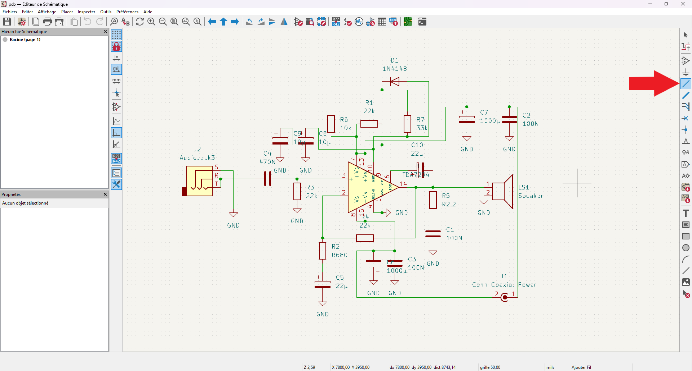

## **Recherches** <!-- omit in toc -->
## Table des matières <!-- omit in toc -->
- [Introduction](#introduction)
- [Le projet](#le-projet)
- [Recherche sur l'électronique fondamentale](#recherche-sur-lélectronique-fondamentale)
  - [**Courant**](#courant)
    - [Sources](#sources)
    - [Qu'est-ce que la ***tension*** ?](#quest-ce-que-la-tension-)
    - [Qu'est-ce que la ***puissance*** ?](#quest-ce-que-la-puissance-)
    - [Qu'est-ce que l'***intensité*** ?](#quest-ce-que-lintensité-)
    - [Qu'est-ce que la ***polarité*** ?](#quest-ce-que-la-polarité-)
    - [Le ***courant continu (CC / DC)*** vs le ***courant alternatif (CA / AC)***](#le-courant-continu-cc--dc-vs-le-courant-alternatif-ca--ac)
  - [**Composantes**](#composantes)
    - [Qu'est-ce qu'un ***condensateur*** ?](#quest-ce-quun-condensateur-)
    - [Qu'est-ce qu'une ***résistance*** ?](#quest-ce-quune-résistance-)
    - [Qu'est-ce qu'une ***diode*** ?](#quest-ce-quune-diode-)
    - [Qu'est-ce qu'un ***transistor*** ?](#quest-ce-quun-transistor-)
    - [Qu'est-ce qu'un ***varistor*** ou une ***varistance*** ?](#quest-ce-quun-varistor-ou-une-varistance-)
    - [Qu'est-ce qu'une ***thermistance*** ?](#quest-ce-quune-thermistance-)
    - [Qu'est-ce qu'une ***photorésistance*** ?](#quest-ce-quune-photorésistance-)
    - [Qu'est-ce qu'un ***potentiomètre*** ?](#quest-ce-quun-potentiomètre-)
    - [Qu'est-ce qu'une ***inductance*** ?](#quest-ce-quune-inductance-)
- [KiCad](#kicad)
  - [Création d'un projet](#création-dun-projet)
  - [Schéma électrique](#schéma-électrique)
  - [Conception du circuit imprimé](#conception-du-circuit-imprimé)
  - [Exportation en GERBER](#exportation-en-gerber)
- [Conclusion](#conclusion)

# Introduction
L'électronique est essentiel dans notre monde moderne, régissant le fonctionnement des appareils que nous utilisons au quotidien et dans tous les domaines. Sans que nous les voyions nécessairement, les pièces électroniques fondamentales qui font partie de nos vies sont assemblées à l'aide de circuits imprimés, ce qui facilite grandement leur intégration aux appareils.

Les circuits imprimés servent donc de supports physiques et de méthode simplifiée pour effectuer tous les branchements entre les différents composants. Il permet également une miniaturisation des circuits électroniques puisque graçe aux machines, une précision beaucoup plus grande peut être appliquée et de plus petites pièces peuvent être utilisées.

Pour concevoir des circuits imprimés, il faut donc avoir une bonne connaissance de l'électronique fondamentale.

# Le projet
Le projet suivant comporte deux grands points principaux très importants.
Le premier étant une recherche sur l'électronique fondamentale et le deuxième portant sur la conception de circuit imprimé à l'aide du logiciel *KiCad*.

Dans un premier lieu, nous verrons les fondamentaux de l'électricité, qui est essentiel pour comprendre le fonctionnement de la grande majorité des composantes électroniques minimales qui seront présentées ensuite. Pour chacun des composants, vous en apprendrez sur leur utilité, leur fonctionnement, et des éléments essentiels à savoir.

Dans un deuxième lieu, nous expérimenterons tout d'abord la conception d'un schéma électronique pour en suivre avec la conception d'un circuit imprimé de base. Il vous sera également expliqué et démontré le fonctionnement de base du logiciel *KiCad* qui servira à réaliser cette expérimentation.

# Recherche sur l'électronique fondamentale

## **Courant**
### Sources
  - Tension, puissance, intensité
      - [edf.fr](https://www.edf.fr/groupe-edf/espaces-dedies/jeunes-enseignants/pour-les-jeunes/lenergie-de-a-a-z/lelectricite-au-quotidien/volt-watt-ampere-les-unites-en-electricite##:~:text=En%20%C3%A9lectricit%C3%A9%2C%20puissance%20%3D%20tension%20x,robinet%20est%20ouvert%20(intensit%C3%A9).)
      - [alterna-energie.fr](https://www.alterna-energie.fr/blog-article/le-courant-electrique-quest-ce-que-cest)
  - Polarité
      - [tme.eu](https://www.tme.eu/be/fr/news/library-articles/page/51361/polarisation-en-electronique-ce-quil-faut-savoir-a-ce-sujet/)
   - Courant continu / alternatif
      - [hydroquebec.com](http://www.hydroquebec.com/comprendre/notions-de-base/continu-alternatif.html##:~:text=Dans%20le%20courant%20alternatif%2C%20les,toujours%20dans%20le%20m%C3%AAme%20sens.) 

### Qu'est-ce que la ***tension*** ?
- Mesuré en *Volts* (*voltage*)
- Sert à mesurer la force électrique du courant
- Traduit la différence de potentiel entre deux points

### Qu'est-ce que la ***puissance*** ?
- Mesuré en *Watts* (*wattage*)
- Sert à mesurer la quantité d'énergie durant un temps donné

### Qu'est-ce que l'***intensité*** ?
- Mesuré en *Ampères* (*ampérage*)
- Sert à mesurer l'intensité d'un courant électrique

### Qu'est-ce que la ***polarité*** ?
- Distinction entre deux points opposés
    - L'un chargé négativement (d'électrons)
    - L'autre par leur déficience (aucune charge)
- Le courant circule d'un point vers l'autre lorsque que le circuit est fermé
- Les distinguer par leurs appellations
    - Positif
        - \+
        - Vivant
        - Actif
        - Ligne
        - Voltage
    - Négatif
        - \-
        - Ground
        - Negatif
        - Neutre*

### Le ***courant continu (CC / DC)*** vs le ***courant alternatif (CA / AC)***
- Courant continu
    - Les électrons se déplacent dans un seul sens
        - Du pôle négatif vers le pôle positif
        - Déplacement en continu
    - Peut être produit par
        - Une réaction chimique (ex: pile)
        - Une conversion à partir du CA
- Courant alternatif
    - Les électrons se déplacent en alternance
    - Possède une fréquence d'oscillation en *Hertz*
    - Produit par un alternateur
        - Aimant qui tourne à l'intérieur d'une bobine
        - Deux pôles de l'aimant crée l'oscillation
    - 99% de l'énergie électrique consommée dans le monde

## **Composantes**
### Qu'est-ce qu'un ***condensateur*** ?

- Élément de stockage de charges électriques
- Trois paramètres principaux
    - Tension en Volts
    - Capacité en Farads
    - Tolérance
    - Type
        - Céramique multicouches ( *MLCC* --> *Multi-Layer Ceramic Capacitor* )
        - Électrolytique
        - À film
        - Ajustable
        - Supercondensateur
- Sources
    - [knowhow.distrelec.com](https://knowhow.distrelec.com/fr/energie-et-alimentation-electrique/guide-des-condensateurs-types-applications-et-choix-de-la-bonne-solution/)
    - [arrow.com](https://www.arrow.com/fr-fr/research-and-events/articles/common-types-of-capacitors-and-how-they-are-made)

### Qu'est-ce qu'une ***résistance*** ?

- Élément servant à diminuer un courant électrique
- Unité d'une résistance
    - Ohm ( Ω ) | **Voir loi d'Ohm**
    - Barres de couleurs servent à indiquer la résistance
- Sources
    - [superprof.fr](https://www.superprof.fr/ressources/physique-chimie/physique-chimie-3eme/conducteur-ohmique-appareil.html)
    - [pccollege.fr](http://pccollege.fr/quatrieme-2/electricite-les-lois-du-courant-continu/chapitre-iv-les-resistances-electriques/)

### Qu'est-ce qu'une ***diode*** ?

- Élément servant à laisser passer le courant dans un sens unique
- Anode = positif
- Cathode = negatif
- Types
    - Diode standard
        - Laisse passer le courant dans un seul sens
    - Diode Zener
        - Sert à réguler la tension
    - Diode redresseur
        - Sert à la conversion CA en CC ( courant alternatif en courant continu )
    - Diode Schottky
        - Même fonctionnement que la diode standard, mais à commutation plus rapide
        - Pour une utilisation à plus haute fréquence
    - Diode électroluminescente ( DEL | LED )
        - Émet de la lumière lorsque la polarité est bonne
    - Diode photodétecteur
        - Sert à convertir la lumière en courant électrique
    - Diode de puissance
        - Même fonctionnement que la diode standard, mais capable de gérer des courants et des tensions plus élevées
    - Diode de protection contre les surtensions
        - Sert à protéger les circuits des surtensions
- Sources
    - [opencircuit.fr](https://opencircuit.fr/blog/hoe-werkt-een-diode)
    - [redeweb.com](https://www.redeweb.com/fr/actualidad/que-es-un-diodo/)

### Qu'est-ce qu'un ***transistor*** ?

- Sert à amplifier, faire basculer des signaux électroniques ou de l’énergie électrique
- Émetteur, base et collecteur

- Sources
    - [canada.lenovo.com](https://canada.lenovo.com/fr/ca/en/glossary/what-is-a-transistor/?orgRef=https%253A%252F%252Fwww.google.com%252F)
    - [lespetitesanalyses.com](https://lespetitesanalyses.com/2023/10/21/quest-ce-quun-transistor/)
    - [couleur-science.eu](https://couleur-science.eu/?d=775902--cest-quoi-un-transistor-comment-ca-marche)

### Qu'est-ce qu'un ***varistor*** ou une ***varistance*** ?

- Sert à protéger les circuits des surtensions
- Adapte sa résistance selon le courant d'entrée
- Peut être considéré comme un régulateur ou un limiteur
- Sources
    - [ourpcbfr.com](https://ourpcbfr.com/varistances-a-oxyde-metallique-mov.html)

### Qu'est-ce qu'une ***thermistance*** ?

- Abréviation de *résistance thermosensible*
- Élément de détection de la température
- Composé d'un semi-conducteur dont la conductivité varie selon la température
- Types
    - Coefficients de température négatifs ( *NTC* )
        - Température augmente ⬆ = résistance décroit ⬇
        - Température diminue ⬇ = résistance acroit ⬆
    - Coefficients de température positif ( *PTC* )
        - Température augmente ⬆ = résistance acroit ⬆
        - Température diminue ⬇ = résistance décroit ⬇
- Sources
    - [omega.com](https://www.omega.fr/prodinfo/thermistances.html)
    - [arrow.com](https://www.arrow.com/fr-fr/research-and-events/articles/how-does-a-thermistor-work)

### Qu'est-ce qu'une ***photorésistance*** ?

- Aussi appellé *LDR*
- Sert à détecter une intensité lumineuse
- La résistance varie selon la luminiosité
    - Luminiosité augmente ⬆ = résistance diminue ⬇
    - Luminiosité diminue ⬇ = résistance augmente ⬆
- Types
    - Intrinsèque
        - Plus le niveau de lumière est élevé, plus le nombre d'électrons libérés est important et plus le niveau de conductivité augmente
    - Extrinsèque
        - Utilisé avec les grandes longueurs d'onde de la lumière
- Sources
    - [passionelectronique.fr](https://passionelectronique.fr/photoresistance/)
    - [ourpcbfr.com](https://ourpcbfr.com/resistance-dependante-de-la-lumiere.html)

### Qu'est-ce qu'un ***potentiomètre*** ?

- Agit comme une résistance variable
- Sert à controler le niveau de courant électrique qui le traverse
- Sources
    - [rayzeek.com](https://www.rayzeek.com/fr/glossary/quest-ce-quun-potentiometre)

### Qu'est-ce qu'une ***inductance*** ?

- Utilités
    - Créer un champ magnétique
    - Filtrer des signaux
    - Filtrer le bruit
    - Stabiliser le courant
    - Supprimer les interférances électromagnétiques
- Types
    - Inductance à air
        - Simple bobine de fil cuivré
        - Inductance plus basse
        - Plus proches des attentes en termes de bande passante et de saturation
    - Inductance à noyau magnétique
        - Accepete des valeurs plus élevées
        - Permet une optimisation de la bande passante
        - Types de noyau
            - Ferrite pour les hautes fréquences
            - Fer pour les basses fréquences
- Sources
    - [techno-science.net](https://www.techno-science.net/definition/3177.html)
    - [circe-technologies.com](https://www.circe-technologies.com/inductance2.html)

# KiCad

### Sources <!-- omit in toc -->
- [docs.kicad.org](https://docs.kicad.org/8.0/fr/getting_started_in_kicad/getting_started_in_kicad.html)
- [youtube.com - 1](https://youtu.be/OlOihLaRphs?si=jovm64S-CJUNUjJX)
    

## Création d'un projet
1. N.b. La version 8.0.2 de *KiCad* a été utilisée pour ce projet
   1. [Télécharger](https://www.kicad.org/download/) le logiciel Open Source *KiCad*
   2. [Installer](https://docs.kicad.org/8.0/en/getting_started_in_kicad/getting_started_in_kicad.html#download-and-install-kicad) le logiciel
   3. Ouvrir le logiciel KiCad
2. Créer un nouveau projet 
    
      
## Schéma électrique
1. Ouvrir l'éditeur de Schématique
    
   
     
2. Ajouter les symboles nécessaires
   1. Ouvrer le menu d'ajout de symbole
   2. Rechercher par texte ou dans la liste le symbole voulu.
   3. Sélectionner votre symbole et faire *OK* pour l'ajouter
   - Répéter ces étapes pour ajouter de nouveaux symboles
   - Il est possible de copier-coller un symbole déjà ajouté au schéma

    
     
   Dans le cadre du projet et afin de ne pas surcharcher les étapes, les symboles sont ajoutés par types, tous à la fois. Il est de votre devoir de tous les ajouter un à un.
     
   1. Ajout du *chip* voulu (ici un amplificateur audio TDA7294) 
       
   2. Ajout des résistances  
       
   3. Ajout des condensateurs  
       
   4. Et ainsi de suite...  
   5. Ajouter des fils (relier les pins ensemble)
        
      À l'aide de l'outil *Ajouter Fil* dans la barre d'outils de droite
## Conception du circuit imprimé
Lorem Ipsum
## Exportation en GERBER
Lorem Ipsum

# Conclusion
Lorem Ipsum